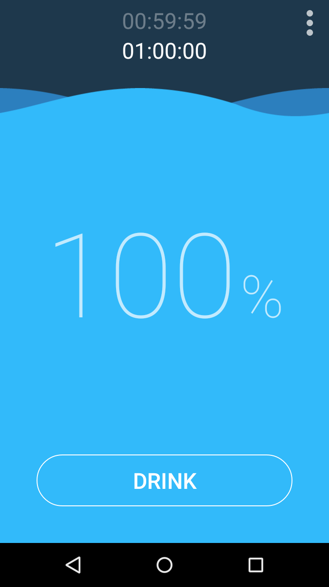

# RemindMe

Little reminder app for water break!

I got the original inspiration from Irko Palenius's work on Codepen https://codepen.io/ispal/details/LxjgEj

All the animations/transitions you see on the app are made using [Android Animation API](https://developer.android.com/training/animation/overview) in [Xamarin.Android](https://docs.microsoft.com/en-us/xamarin/android/).

You can download the application from Playstore: https://play.google.com/store/apps/details?id=com.kudchikarsk.remindme

